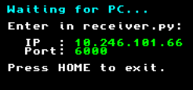
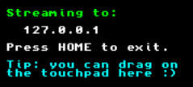
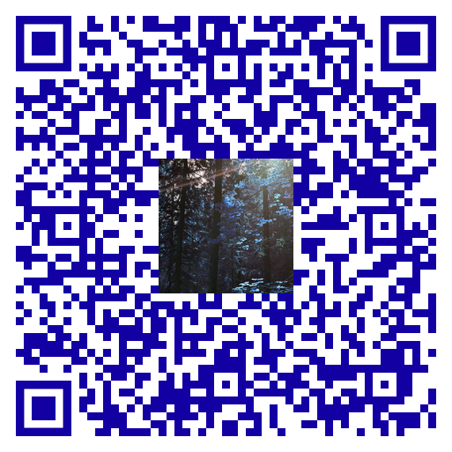

# 3ds-brew-remote

This is a client-host communication tool that can turn a Nintendo 3DS into different types of remote-controlled devices.

This is **NOT** a bluetooth tool; data is transmitted via the **IEEE 802.11b/g** protocol (2.4GHz WiFi), which is then captured and processed as device input.

Due to many controllers sharing similar inputs, I figured I'd make a tool that remaps inputs from one to emulate others.

# How it Works
## 3DS Client
The `3DS Client` captures all inputs and packages the data as UDP packets using a shared custom protocol.\
This includes:
- `Joycon` Positioning (normalized to &plusmn;1)
- `A/B/X/Y`, `UP/DOWN/LEFT/RIGHT`, `LR/RR` Button Input
- `Touchcreen` Input & Position
- `3-axis Gyroscope` and `3-axis Accelerometer` data (normalized to &plusmn;1)

If you have a Circle Pad Pro / New 3DS, it also reads:
- `Secondary Joycon` Positioning (normalized to &plusmn; 1, CPP only)
- `ZL/ZR` Button Input

In the former screen (before connecting), its own IPv4 Address to and awaits the Server, listening on port 6000; after connecting to a server, it switches to the latter screen:\

\
The first address is private and will be different for you. Same for the second, as this is a loopback address.

Inputs are streamed over UDP at 60Hz, with the aforementioned data.\
**The client itself is pretty simple, and the fun stuff comes from the capturer.**

## Server / Host Capturer
- Currently this is for linux only, as it writes to`/dev/input/` to emulate different devices.
- Provide a graphical interface to connect to the 3DS. It should be apparent that you should be connected to the same network.
- Options to read and calibrate input and re-map inputs to 
# Installation
### Installing 3DS Client
- This requires a 3DS with custom firmware, as this is a homebrew application.
- For installing with `FBI`, scan this QR code: **(turn down brightness if 3DS camera is fuzzy)**\

### Installing Server / Capturer
- (todo) make a real graphical interface and deploy to docker with xyz args
- decide on if we want to make interaction shell a webpage, electron app, or something else

# Building it Yourself
- see `README.md` in [/3ds/](./3ds/)

# Creds/Licensing:
### [**ftpd** for 3DS by **mtheall**](https://github.com/mtheall/ftpd) - GPL 3.0 Licensing
- This group's app inspired me to try and make my own. I used app platforming/simple logging from a classic build of this repo.
- Thanks these people for inspo and providing a basic app framework, as I had no idea where/how to start developing a 3ds app.

### Assets
- **[Alfarran Basalim](https://pixabay.com/users/farran_ez-45967570/)** - [*3DS Banner Audio*](/3ds/meta/audio.wav) - Pixabay Content License
- **[blackdovfx](https://www.istockphoto.com/portfolio/blackdovfx)** - [*3ds Icon*](/3ds/meta/icon.png) - iStock Content License